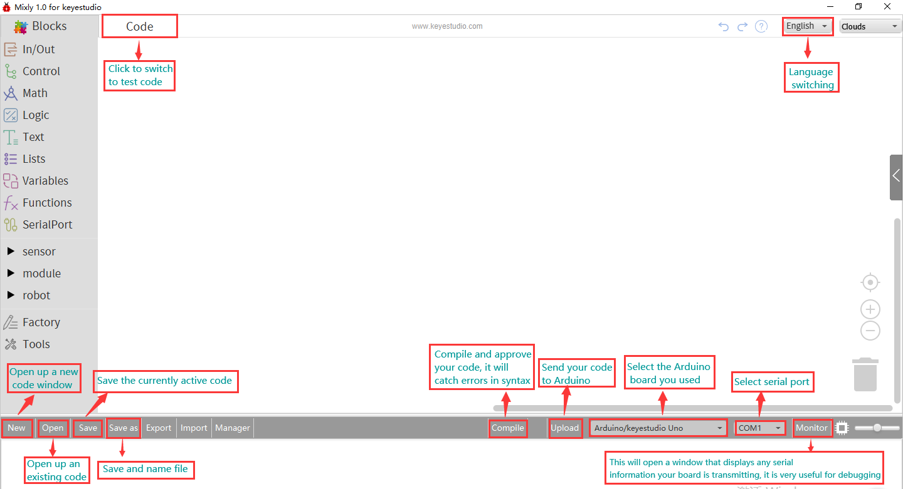
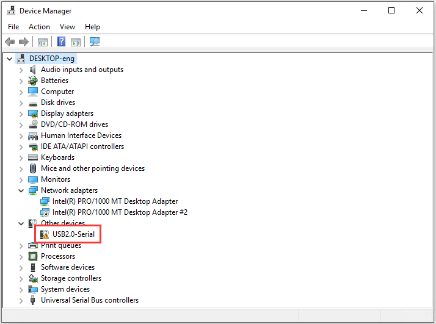
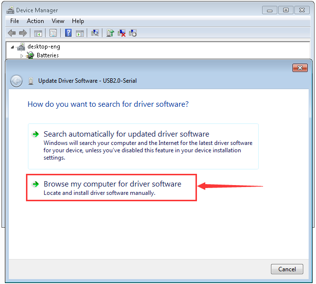
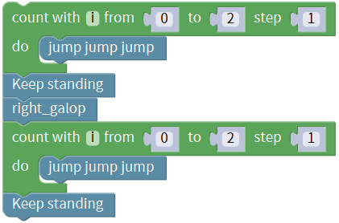
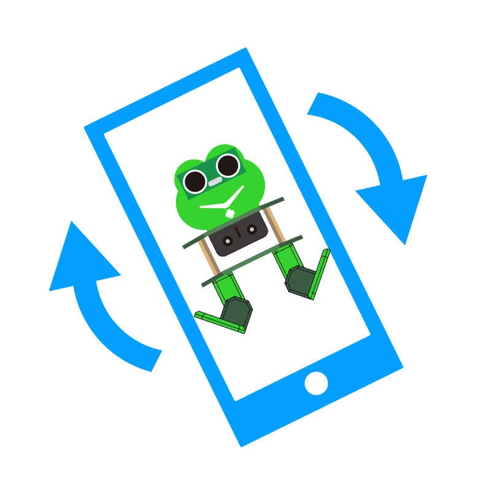
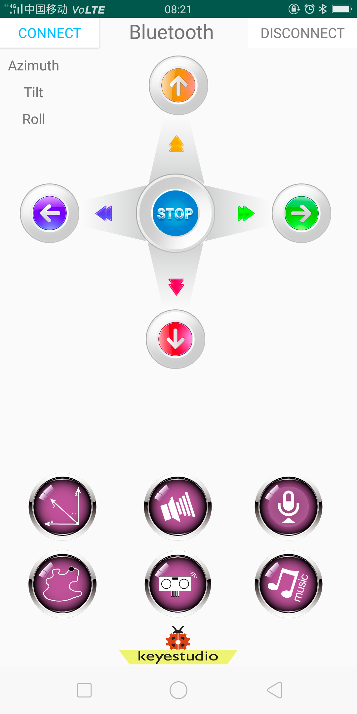
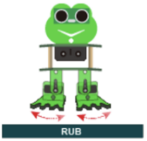
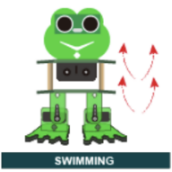
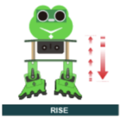

# **KS0446 Keyestudio Frog Robot for Mixly Tutorial**

## About the tutorial

What an amazing Otto Frog Robot is coming!

This kit provides a perfect opportunity to build your very first robot, and it
makes the process of learning about robotics easy, interactive, and FUN!

The kit is based on the keyestudio nano ch340, compatible with both Arduino
open-source platform and Mixly Blocks coding.

You can program your own robot to walk, dance and follow obstacle, easy to build
and code. No prior tech experience required!

Through play and experimentation children can exercise computational thinking
and put skills into practice that are necessary for problem solving.

## Features

-   Voltage input: DC 7-12V

-   Ultrasonic module for measuring the front obstacle distance, forming
    obstacle avoiding system;

-   Pairing HM-10 Bluetooth module with mobile Bluetooth to navigate the frog
    robot;

-   Providing the mobile APP compatible with both Android and mac system;

-   The NANO shield extends 12 digital pins and 8 analog pins into 3pin header,
    easy to connect a couple of sensor modules for projects extension;

-   The NANO shield comes with an I2C communication pin, able to connect I2C
    communication module for experiment extension.

## Parts List

In this keyestudio frog robot kit package, you’ll receive all the components
needed to build your own robot, easy to code and learn to play.

| **No.** | **Item**                                                                         | **QTY** | **Picture**                                                                                                                                                                                                                      |
|---------|----------------------------------------------------------------------------------|---------|----------------------------------------------------------------------------------------------------------------------------------------------------------------------------------------------------------------------------------|
| 1       | Keyestudio nano ch340                                                            | 1       |                                                                                                                                                                          |
| 2       | AM/mini5P transparent blue OD:5.0 L=30cm USB cable                               | 1       |                                                                                                                                                                          |
| 3       | keyestudio NANO shield                                                           | 1       |                                                                                                                                                                          |
| 4       | Keyestudio HM-10 Bluetooth-4.0 V3 compatible with HC-06 pins                     | 1       |                                                                                                                                                                          |
| 5       | HC-SR04 Ultrasonic sensor                                                        | 1       |                                                                                                                                                                          |
| 6       | 18650 2-cell Battery case with JST-PH2.0MM-2P lead(115MM)                        | 1       |                                                                                                                                                                          |
| 7       | M1.6\*10MM round-head screw                                                      | 4       |                                                                                                                                                                     |
| 8       | M1.6 304 stainless steel nut                                                     | 4       |                                                                                                                                                                            |
| 9       | M3\*6MM round-head screw                                                         | 16      |                                                                                                                                                                            |
| 10      | M3\*10MM round-head screw                                                        | 10      |                                                                                                                                                                            |
| 11      | M3\*10MM flat-head screw                                                         | 3       |                                                                                                                                                                     |
| 12      | M3 nickel plating nut                                                            | 14      |                                                                                                                                                                     |
| 13      | M2\*10MM round-head screw                                                        | 8       |                                                                                                                                                                       |
| 14      | M2 nickel plating nut                                                            | 12      |                                                                                                                                                                       |
| 15      | M1.2X5MM tapping screw                                                           | 12      |                                                                                                                                                                            |
| 16      | M3 304 self-locking nut                                                          | 2       |                                                                                                                  |
| 17      | Dual-pass M3\*10MM                                                               | 4       |                                                                                                                                                                       |
| 18      | Dual-pass M3\*30MM                                                               | 4       |                                                                                                                                                                       |
| 19      | Acrylic plate 3PCS  215\*120MM T=3MM  transparent green environmental protection | 1       |                                                          |
| 20      | Servo MG90S（14g）23\*12.2\*29mm(black) 180°                                     | 4       |  |
| 21      | Female to female 10CM Jumper wire                                                | 20      |                                                                                                                                                                          |
| 22      | yellow and black Handle 3\*40MM cross screwdriver                                | 1       |                                                                                                                                                                          |
| 23      | Transparent red film acrylic double-sided adhesive tape                          | 1       |                                                                                                                                                                          |
| 24      | Flange bearing                                                                   | 2       |                                                                                                                                                                          |

**  
**

1.  **Install Mixly and Driver**

### Download Mixly Software

**① Introduction for Mixly**

Mixly is a free open-source graphical Arduino programming software, based on
Google’s Blockly graphical programming framework, and developed by Mixly Team@
BNU.

It is a free open-source graphical programming tool for creative electronic
development; a complete support ecosystem for creative e-education; a stage for
maker educators to realize their dreams.

Although there is an Ardublock graphical programming software launched by
Arduino official, Ardublock is not perfect enough, and many common functions
cannot be realized.

**②Download and install mixly1.0 software**

There are two kind installation packages provided for you in the following
links:

[Mixly1.0 for Win
7/8/10](http://116.62.49.166/Mixly_WIN.7z)：<https://fs.keyestudio.com/Mixly1-Windows>

[Mixly1.0 for
Mac](https://116.62.49.166/MixlyMac.zip)：<https://fs.keyestudio.com/Mixly1-MACOS>

**Windows version：**

We will take Mixly1.0 (Windows version) as example.

**Install Software：**

You will get installation package after downloading. As shown below:

Unzip the package, you will see “Mixly 1.0 for keyestudio.exe”

Double-click ”Mixly 1.0 for
keyestudio.exe”, the following interface pops up.

Mixly 1.0 interface:

More details about Mixly 1.0 for
keyestudio：<https://wiki.keyestudio.com/Getting_Started_with_Mixly1.0>

### Install Driver

Let’s install the driver of development board. The USB to serial chip of control
board adopts CH340 chip, therefore, the driver of chip needs installing. We take
Windows system as example.

Double-click Mixly 1.0 for keyestudio folder→Arduino→drivers, as shown below;

Then tap “drivers”.

**If your PC is Windows10:**

When you connect the board to your computer at the first time, right click the
icon of your *“Computer” —\>for “Properties”—\> click “Device manager”*, under
“Other Devices”, you should see an icon for “USB2.0-Serial” with a little yellow
warning triangle next to it, as shown below：

After a while, the driver USB-SERIAL CH340 will be installed automatically.

If no response, you can right-click
“**USB2.0-Serial**”→“**USB2.0-Serial**”→“**Search automatically for updated
driver software**”; then wait for the installation.

Right click Computer----- Properties----- Device Manager, as shown below:

If your PC is not Windows 10, you will need to install manually.

Go to KS0446 Keyestudio.... Programming folder→Resources→usb_ch341_3.1.2009.06

We need to use driver usb_ch341_3.1.2009.06.

When you connect the board to your computer at the first time, right click the
icon of your *“Computer” —\>for “Properties”—\> click “Device manager”*, under
“Other Devices”, you should see an icon for “USB2.0-Serial” with a little yellow
warning triangle next to it.

Then right-click on the device and select the top menu option (Update Driver
Software...) shown as the figure below.

It will then be prompted to either “Search Automatically for updated driver
software” or “Browse my computer for driver software”. Shown as below. In this
page, select “Browse my computer for driver software”.

Click “Browse” to select “usb_ch341_3.1.2009.06” and tap “OK”.

“usb_ch341_3.1.2009.06”driver folder is located in folder KS0446 Keyestudio Frog
Robot......Programming

Click “Next”，once the software has been installed, you will get a confirmation
message. Installation completed, click “Close”.

Up to now, the driver is installed well. Then you can right click*“Computer”
—\>“Properties”—\>“Device manager”*, you should see the device as the figure
shown below.

### Start Your Program

Click“Open”→ sample → arduino→ Arduino → 01 IN-OUT→01-LED Blink.mix

In order to avoid errors when downloading code to Arduino development board, we
must select correct Arduino board. (Notice: we use NANO board in the tutorial,
therefore, **Arduino/keyestudio Nano[atmega328]** should be selected when
setting board)

The corresponding board and COM port will be shown after setting board and COM
port.

Click **Compile** to start compiling the program, check errors.

Click **Upload** to upload the program, upload successfully.

After uploading the program successfully, the on-board LED blinks for 1s.
Congratulation, you finish the first program.

## Hardware Projects

As you work your way through each project, you will learn to how to program the
robot to move, dance, and follow obstacles.

### Project 1: Keyestudio NANO CH340

**Introduction:**

The keyestudio Nano CH340 is a small, complete, and breadboard-friendly board
based on the ATmega328P-AU. Compared with ARDUINO NANO, the USB-to-serial port
chip used in keyestudio Nano is CH340G, so that the using method is the same
except the driver installation file.

It has 14 digital input/output pins (of which 6 can be used as PWM outputs), 8
analog inputs, a 16 MHz crystal oscillator, a mini USB port, an ICSP header and
a reset button.

The keyestudio Nano can be powered via the Mini-B USB connection, or female
headers Vin/GND (DC 7-12V).

**TECH SPECS:**

| **Microcontroller**             | ATmega328P-AU                                |
|---------------------------------|----------------------------------------------|
| **Operating Voltage**           | 5V                                           |
| **Input Voltage (recommended)** | DC7-12V                                      |
| **Digital I/O Pins**            | 14 (D0-D13)  (of which 6 provide PWM output) |
| **PWM Digital I/O Pins**        | 6 (D3, D5, D6, D9, D10, D11)                 |
| **Analog Input Pins**           | 8 (A0-A7)                                    |
| **DC Current per I/O Pin**      | 40 mA                                        |
| **Flash Memory**                | 32 KB of which 2 KB used by bootloader       |
| **SRAM**                        | 2 KB                                         |
| **EEPROM**                      | 1 KB                                         |
| **Clock Speed**                 | 16 MHz                                       |
| **LED_BUILTIN**                 | D13                                          |

**Element and Interfaces:**

Here is an explanation of what every element and interface of the board does:

| **1**  | **ICSP Header**                        | **ICSP (In-Circuit Serial Programming) Header** ICSP is the AVR, an micro-program header consisting of MOSI, MISO, SCK, RESET, VCC, and GND. It is often called the SPI (serial peripheral interface) and can be considered an "extension" of output. In fact, slave the output devices under the SPI bus host. When connecting to PC, program the firmware to ATMEGA328P-AU.                                                                                                                     |
|--------|----------------------------------------|---------------------------------------------------------------------------------------------------------------------------------------------------------------------------------------------------------------------------------------------------------------------------------------------------------------------------------------------------------------------------------------------------------------------------------------------------------------------------------------------------|
| **2**  | **LED indicator** **（RX）**           |  Onboard you can find the label: RX(receive ) When control board communicates via serial port, receive the message, RX led flashes.                                                                                                                                                                                                                                                                                                                                                               |
| **3**  | **LED indicator** **（TX）**           |  Onboard you can find the label: TX (transmit) When control board communicates via serial port, send the message, TX led flashes.                                                                                                                                                                                                                                                                                                                                                                 |
| **4**  | **LED indicator** **（POW）**          |  Power up the control board, LED on, otherwise LED off.                                                                                                                                                                                                                                                                                                                                                                                                                                           |
| **5**  | **LED indicator** **（L）**            |  There is a built-in LED driven by digital pin 13. When the pin is HIGH value, the LED is on, when the pin is LOW, it's off.                                                                                                                                                                                                                                                                                                                                                                      |
| **6**  | **RX0（D0）** **TX1（D1）** **D2-D13** | It has 14 digital input/output pins D0-D13 (of which 6 can be used as PWM outputs). These pins can be configured as digital input pin to read the logic value (0 or 1). Or used as digital output pin to drive different modules like LED, relay, etc.                                                                                                                                                                                                                                            |
| **7**  | **RST**                                | Reset pin: connect external button. The function is the same as RESET button.                                                                                                                                                                                                                                                                                                                                                                                                                     |
| **8**  | **MEGA 328P**                          |  Each board has its own microcontroller. You can regard it as the brain of your board. Microcontrollers are usually from ATMEL. Before you load a new program on the Arduino IDE, you must know what IC is on your board. This information can be checked at the top surface of IC. The board’s microcontroller is ATMEGA328P-AU.  More info. see the [datasheet](http://101.96.10.64/ww1.microchip.com/downloads/en/DeviceDoc/Atmel-42735-8-bit-AVR-Microcontroller-ATmega328-328P_Summary.pdf)  |
| **9**  |  **MINI USB**                          |  The board can be powered via Mini-B USB connection. Also upload the program to the board via USB port.                                                                                                                                                                                                                                                                                                                                                                                           |
| **10** | **3V3 pin**                            |  Provides 3.3V voltage output                                                                                                                                                                                                                                                                                                                                                                                                                                                                     |
| **11** | **REF**                                |  Reference external voltage (0-5 volts) for the analog input pins. Used with [analogReference()](https://www.arduino.cc/reference/en/language/functions/analog-io/analogreference/).                                                                                                                                                                                                                                                                                                              |
| **12** | **A0-A7**                              |  The Nano has 8 Analog Pins, labeled A0 through A7.                                                                                                                                                                                                                                                                                                                                                                                                                                               |
| **13** | **5V pin**                             |  Provides 5V voltage output                                                                                                                                                                                                                                                                                                                                                                                                                                                                       |
| **14** | **GND**                                |  Ground pin                                                                                                                                                                                                                                                                                                                                                                                                                                                                                       |
| **15** | **VIN**                                |  Input an external voltage DC7-12V to power the board.                                                                                                                                                                                                                                                                                                                                                                                                                                            |
| **16** | **Reset** **Button**                   |  Used to reset the control board                                                                                                                                                                                                                                                                                                                                                                                                                                                                  |
| **17** | **CH340G**                             |  USB-to-serial port chip, converting the USB signal into Serial port signal.                                                                                                                                                                                                                                                                                                                                                                                                                      |
| **18** | **AMS1117**                            |  Convert the external voltage input DC7-12V into DC5V, then transfer it to the processor and other elements.                                                                                                                                                                                                                                                                                                                                                                                      |

**Specialized Functions of Some Pins:**

-   **Serial communication:** 0 (RX) and 1 (TX). Used to receive (RX) and
    transmit (TX) TTL serial data.

-   **PWM (Pulse-Width Modulation):** D3, D5, D6, D9, D10, D11

-   **External Interrupts:** D2 (interrupt 0) and D3 (interrupt 1). These pins
    can be configured to trigger an interrupt on a low value, a rising or
    falling edge, or a change in value. See the
    [attachInterrupt()](https://www.arduino.cc/reference/en/language/functions/external-interrupts/attachinterrupt/)
    function for details.

-   **SPI communication:** D10 (SS), D11 (MOSI), D12 (MISO), D13 (SCK).

-   **IIC communication:**  A4 (SDA); A5(SCL)

### Project 2: keyestudio NANO Shield

**Overview**

keyestudio Nano ch340 is a tiny control board based on Arduino platform, which
is deeply popular.

However, if want to connect several sensor modules to keyestudio Nano ch340, and
connect external power, we need to use breadboard and a bunch of jumper wires,
which is pretty inconvenient.

We specially design this NANO shield, fully compatible with keyestudio Nano
ch340.

The NANO shield has brought out digital and analog pins of keyestudio Nano ch340
into 3PIN headers (GND, 5V, Signal) with pin pitch of 2.54mm.

The NANO shield also leads out frequently-used communication pins, such as
serial port communication and I2C communication. It’s greatly easy to connect
keyestudio Nano ch340 and other sensor modules.

It comes with a power indicator and a reset button as well.

For external power, the
NANO shield comes with a PH2.0-2P connector (input DC7-12V); a Power_Switch for
power control.

To supply power for other sensors, the NANO shield comes with a 3-way DC3.3V
power output pin header with pin pitch of 2.54mm.

It comes with 4 fixing holes with a diameter of 3mm, so easy to mount on other
devices.

**Features**

1.  Extends 12 digital pins into 3pin header

2.  Extends 8 analog pins into 3pin header

3.  Comes with a serial communication pin header (for Bluetooth module)

4.  Comes with an I2C communication pin

5.  Comes with 3-way DC 3.3V power output pin

6.  Comes with a power indicator and a reset button

7.  Comes with an external power connector（PH2.0-2P）and a control button

**Technical Parameters**

-   Voltage input: DC7-12V

-   Power connector: PH2.0-2P

-   Pin/Female header: 2.54mm

-   Fixing hole diameter: 3mm

-   Dimensions: 57mm\*54mm\*17mm

-   Weight: 20.4g

**Controller Compatible**

-   keyestudio Nano ch340

**PINOUTS**

****

Simply stack the keyestudio Nano ch340 into the keystudio NANO shield. Supply
the power with batteries via white connector.

### Project 3: Adjusting Servo Angle

In the process of frog robot DIY, the frog robot has a 180° servomotor at each
joint. We can control the servomotor at each joint to rotate at different
angles, thus controlling the frog robot to run different actions.

In this course we focus on the principle and usage of the servomotor in the frog
robot kit.

The servomotor is a position servo driver that can rotate between 0 and 180
degrees. If you want your robot assistant to help you get a book, the robot arm
rotation angle is too big or too small, so that can't pick up the book. Only the
angle is just right, it can complete the task of taking the book, so can
accurately control the angle.

Servo motor is a position control rotary actuator. It mainly consists of
housing, circuit board, core-less motor, gear and position sensor.

Included with your servo motor
you will find a variety of black mounts that connect to the shaft of your servo.

You may choose to attach any mount you wish for the circuit. It will serve as a
visual aid, making it easier to see the servo spin.

**Working principle:**

The receiver or MCU outputs a signal to the servomotor. The motor has a built-in
reference circuit that gives out reference signal, cycle of 20ms and width of
1.5ms. The motor compares the acquired DC bias voltage to the voltage of the
potentiometer and outputs a voltage difference.

Servo motor comes with many specifications. But all of them have three
connection wires, distinguished by brown, red, orange colors (different brand
may have different color).

Brown one is for GND, red one for power positive, orange one for signal line.

The rotation angle of servo motor is controlled by regulating the duty cycle of
PWM (Pulse-Width Modulation) signal. The standard cycle of PWM signal is 20ms
(50Hz).

Theoretically, the width is distributed between 1ms-2ms, but in fact, it's
between 0.5ms-2.5ms. The width corresponds the rotation angle from 0° to 180°.

But note that for different brand motor, the same signal may have different
rotation angle.

We can set the HIGH/LOW for corresponding pins in the Mixly blocks software, so
as to adjust the servo angle; furthermore, we specially create the robot
library, so easy to control the servo angle with simplified code.

**Connection Diagram**

Simply stack the keyestudio Nano ch340 into the keystudio NANO shield.

Connect the Servo pin to digital pin 4

****

**Source Code**

Test the angle that servo motor moves between 0°and 180°

First of all, go to **“Control”**, drag and drop the command block **“count
with(i)from(1)to(10)step(1) do”**

And modify as **from 0 to 180, step 1**.

Enter **“robot”** and click **“Frog_Robot”**, drag and drop the block

This block library has set well the pulse width; can change the pin0 into any
digital pins. Because the signal wire of servo motor is connected to digital
**pin 4**, should change the pin0 to pin4.

Go to **“Variables”**, drag and drop the
variableinto angle 0 block. Set
the delay time in any millisecond. We set to delay **200ms**. The servo will
slowly rotate from 0° to 180° for every 1° increase.

After that, we duplicate the above code string once, and set the value from 180
to 0, step set to -1. The rest keep same. Upload the complete code.

**Test Result**

Upload the Code success, press down the Power_Switch, the servo motor will
rotate back and forth from 0°to 180°.

**Little Knowledge:**

1.  this piece of block is used
    to direct regulate the servo. connect the servo signal pin to D4; set the
    servo angle to a variable,
    that is, this defined variable is applied to regulate the servo angle.

Because the servo angle is in the range of 0-180°, the range of
variable should set from 0 to
180.

The delay period is in milliseconds, so if you want the servo turn more fast,
change the value to 100.

1.  This block means variable i
    increases from 0 to 180, and each step increases 1.

This block means variable **i**
reduces from 180 to 0, and each step reduces 1.

**Extension Practice:**

1.  Refer to the test code. Try to reset the servo pin and rotation speed

    (Tips: set the delay time for servo angle ; or adjust to increase/reduce the
    step, which should be divisible by 180, like 2, 3, 5.)

### Project 4: Ultrasonic Detecting Obstacles

The ultrasonic module will emit the ultrasonic waves after trigger signal. When
the ultrasonic waves encounter the object and are reflected back, the module
outputs an echo signal, so it can determine the distance of object from the time
difference between trigger signal and echo signal.

We can use the ultrasonic sensor to detect whether there is an obstacle ahead.
It is commonly used to measure the distance between the front obstacle and
robot.

In the process of robot DIY, we can use the measured distance by ultrasonic
sensor to build functional robots, such as automatic avoiding, following, etc.

In the experiment, we use the ultrasonic sensor to measure the distance between
the robot and front obstacle.

The following picture is an ultrasonic module.

**Specifications:**

-   Operating voltage: DC 5V

-   Operating current: 15mA

-   Operating frequency: 40khz

-   Maximum detection range: 3-5m

-   Minimum detection range: 2cm

-   Induction Angle: less than 15 degrees

-   High accuracy: up to 3mm

**Hookup Guide**

****

Connect the ultrasonic sensor to NANO shield, VCC pin to 5V(V), Trig pin to
digital 6 (S), Echo pin to digital 7 (S), GND pin to GND(G); Then stack the NANO
CH340 into the NANO shield.

**Test Code**

Go to **“Control”**, drag out the **“setup”** block;

Go to **“SerialPort”**, drag out the block **“Serial baud rate(9600)”** and
**“Serial printIn”** , then drag the block **“Serial baud rate(9600)”** into the
**“setup”** block.

Enter **“robot”** and click **“Frog_Robot”**, drag and drop the ultrasonic
block into **“Serial printIn”**
block.

And again go to **“Control”**, drag the delay
block; set the delay time in
**200ms**.

Complete and upload the code.

**Test Result**

Upload the code success, press the Power_Switch on NANO shield.

Open the **Monitor** and set **the baud rate to 9600**.

Move your hand or a large, flat object closer and farther away from the
ultrasonic sensor. As the object approaches, the monitor will show the distance
(unit:cm) being read from the sensor.

**Little Knowledge:**

1.  In the code, we use theto
    measure the distance between ultrasonic sensor and obstacle ahead, with a
    unit of cm.

2.   means the baud rate is set
    to 9600;   
    : print the distance value on
    the newline of monitor.

If use the , only print out the
value but no line wrap.

1.  What happens when you change the number in the delay(200) :

This delay period is in milliseconds, so if you want the LED display as low,
change the value, try 2000.

**Extension Practice:**

1.  You can add new texts or distance unit (cm) on the monitor display.

    

2.  Change the baud rate and delay time to see the result.

    

## Robot Projects

Let’s get started to assembling the lovely frog robot to move, dance or even
follow objects. Do operate the robot easily with Bluetooth APP!

Follow this easy and simple instruction of how to install and program your Otto
Frog Robot!

### ROBOT ASSEMBLY

All the parts for building frog robot are included in the kit, assembling them
is easy and typically takes around two hours!

**Note:**

Before install the frog robot, first need to regulate the 4 servo motors to 90°

Stack the Nano ch340 onto the Nano shield; connect 4 servo motors to digital
pin5,4,3,2 separately.

****

**Code:**

Upload the code below to turn the 4 servos to 90°

(Refer to project 3)

Open the Mixly 1.0 for keyestudio software, Enter **“robot”** and click
**“Frog_Robot”**, drag out the block
and duplicate it three times.
Change the pin0 into pin2, pin3, pin4 and pin5 respectively. Angle set to 90;
delay in 500ms.

Upload the test code to adjust well the servo angle.

##### Fix Feet

##### Fix Legs to Feet

##### Fix Head to Body

**Components：**

① 4pcs M1.6X10MM screws

② 4pcs M1.6 nuts

③ 1pcs ultrasonic sensor

④ 1pcs frog face Acrylic

**Tools：**

① M3 screwdriver x1

**Assembly:**

Peel the adhesive backing off the Acrylic plate.

Mount the ultrasonic sensor to Acrylic plate as figure C-1; tighten the screws,
and notice the hole alignment.

Shown as figure C-1

C-1

**Components：**

① 4pcs M3X30MM dual-pass copper pillar

② 4pcs M3x6 screws

③ 1pcs frog head Acrylic

**Tools：**

① M3 screwdriver x1

**Assembly:**

Peel the adhesive backing off the Acrylic plate.

Fix the copper pillar to Acrylic plate with screws as figure C-2; tighten the
screws, and note that copper pillars are on the same side of logo; keep the hole
alignment.

Shown as figure C-2

C-2

**Components：**

① 4pcs M3X10MM dual-pass copper pillar

② 4pcs M3x6 screws

③ complete Accessory C-2

**Tools：**

① M3 screwdriver x1

**Assembly:**

Fix the copper pillar to Acrylic plate with screws as figure C-3; tighten the
screws, and note that copper pillars are on the back of logo; keep the hole
alignment.

Shown as figure C-3

C-3

**Components：**

① Complete Accessory C-1

② Complete Accessory C-3

③ 1pcs M3X10MM flat-head screw

④ 1pcs M3 nut

**Tools：**

① M3 screwdriver x1

**Assembly:**

Put the M3 nut inside cross hole of Acrylic plate and fix the two Acrylic plate
together with a M3X10MM flat-head screw, shown as figure C-4;

keep the hole alignment;

Gently tighten the screw to acrylic, avoiding breaking up the acrylic plate.

Shown as figure C-4

C-4

**Components：**

① Complete Accessory C-4

② 2pcs M3X10MM flat-head screws

③ 2pcs M3 nuts

④ 1pcs 18650 battery case

**Tools：**

① M3 screwdriver x1

**Assembly:**

Align the battery case to the holes on Acrylic plate, and fix it with screws
from the bottom up, shown as figure C-5;

keep the hole alignment;

Battery case lead is under the logo direction.

Shown as figure C-5

C-5

**Components：**

① Complete Accessory C-5

② 1pcs NANO control board

③ 1pcs NANO shield

④ 4pcs M3X6MM cross screws

**Tools：**

① M3 screwdriver x1

**Assembly:**

Align the NANO shield to the holes of four M3x10MM copper pillar mounted on
Acrylic top plate, shown as figure C;

keep the hole alignment; gently tighten the screws to pillars with a M3
screwdriver.

Stack the NANO control board onto the NANO shield.

Shown as figure C

C

##### Fix Servos to Body

**Components：**

① 4pcs M2x10MM screws

② 4pcs M2 nuts

③ 2pcs 9G Servo

④ 1pcs frog head bottom acrylic

**Tools：**

① M3 screwdriver x1

**Assembly:**

Peel the adhesive backing off the Acrylic plate.

Fix the servo to acrylic plate with M2x10MM screws and M2 nuts, shown as figure
D-1;

keep the hole alignment; servo rotation spin is on the same side. Ensure the
servo angle is in 90°.

Shown as figure D-1

D-1

**Components：**

① 4pcs M1.2x5MM tapping screws

② 2pcs white servo mounts

③ 2pcs Acrylic plates

**Tools：**

① M3 screwdriver x1

**Assembly:**

Peel the adhesive backing off the Acrylic plate.

Fix the white servo mounts to acrylic plate with M1.2x5MM tapping screws from
right to left, shown as figure D-2;

keep the hole alignment;

Shown as figure D-2

D-2

**Components：**

① 4pcs M1.2x5MM tapping screws

② 2pcs white servo mounts

③ 2pcs Acrylic plates

**Tools：**

① M3 screwdriver x1

**Assembly:**

Peel the adhesive backing off the Acrylic plate.

Fix the white servo mounts to acrylic plate with M1.2x5MM tapping screws from
right to left, shown as figure D-2;

keep the hole alignment;

Shown as figure D-2

**Components：**

① Accessory D-1

② Accessory D-2

③ 2pcs M2X4 screws (included in servo bag)

**Tools：**

① M3 screwdriver x1

**Assembly:**

Plug the Accessory D-2 acrylic into servo spin and fix them with M2X4 screws,
shown as figure D;

Note should keep the servo angle 90°. (servo angle has been adjusted to 90°, so
that cannot change by hand; maybe the servo is set to 90° but fail to be
installed in 90° with acrylic, no worry, just get as close to 90° as possible
and you can adjust the angle later in the program.)

Shown as figure D

D

##### Complete Frog

**Components：**

① Accessory A-B

② Accessory D

③ 4pcs M3X10MM cross screws

④ 4pcs M3 nuts

**Tools：**

① M3 screwdriver x1

**Assembly:**

First turn the Accessory D servo acrylic to 90°, shown as figure A-B-D;

Fix the acrylic plates together with M3X10MM cross screws and M3 nuts;

Same process for the two legs;

Note that gently tighten the screws to avoid damage the acrylic.

Shown as figure A-B-D

A-B-D

**Components：**

① Accessory A-B

② Accessory D

③ 4pcs M3X10MM cross screws

④ 4pcs M3 nuts

**Tools：**

① M3 screwdriver x1

**Assembly:**

First turn the Accessory D servo acrylic to 90°, shown as figure A-B-D;

Fix the acrylic plates together with M3X10MM cross screws and M3 nuts;

Same process for the two legs;

Note that gently tighten the screws to avoid damage the acrylic.

Shown as figure A-B-D

**Components：**

① Accessory A-B-D

② Accessory C

③ 4pcs M3X6MM cross screws

**Tools：**

① M3 screwdriver x1

**Assembly:**

First turn the Accessory A-B-D acrylic to 90°, shown as figure A-B-C-D;

Align the four pillars on Accessory C to the holes of Accessory A-B-D acrylic;

From the bottom up, use four M3X6MM screws to fix them gently, avoiding breaking
up the acrylic plates.

Shown as figure A-B-C-D

The frog robot is installed well.

The final part is to connect all the wires.

A-B-C-D

##### Hookup Guide

Connect the HC-SR04 ultrasonic sensor to keyestudio NANO shield using 4pin
female to female jumper wires. VCC pin to 5V(V), Trig pin to digital 6 (S), Echo
pin to digital 7 (S), GND pin to GND(G);

(The ultrasonic sensor wiring can refer to the Project 4)

Connect the signal wire (orange) of 4 servo motors to digital pin5,4,3,2
separately; brown wire to GND(G); red wire to 5V (V).

(The 4 servos wiring can refer to the Project 3)

The 4 servo motors’ wiring figure:

**---------------**

**\| O O \|**

**\|---------------\|**

**YR D3==\> \|  \|  \<== YL D2**

**---------------**

**\|\| \|\|**

**\|\| \|\|**

**RR D5==\> ----- ------  \<== RL D4**

**\|----- ------\|**

Plug in the Keyestudio HM-10 Bluetooth-4.0 module to pin header TX, RX, GND, 5V
on the keyestudio NANO shield.

### Project 5: Walk

**Circuit Design**

After completing the robot assembly, you’ll see the 4 Servo motors on the robot
are connected well to the keyestudio Nano ch340 shield.

We have introduced the knowledge of how to adjust the Servo angle.

In the circuit, we are going to make the 4 Servo motors switch different angles
using keyestudio Nano ch340 shield, so as to operate the frog robot walk.

**How it works?**

When design the Otto frog robot, should first design the 4 Servo motors’
position and corresponding control pins.

Check the detailed instructions for servo control pins. As the figure shown
below.

**---------------**

**\| O O \|**

**\|---------------\|**

**YR D3==\> \|  \|  \<== YL D2**

**---------------**

**\|\| \|\|**

**\|\| \|\|**

**RR D5==\> ----- ------  \<== RL D4**

**\|----- ------\|**

**Hookup Guide:**

Simply stack the keyestudio Nano ch340 into the keystudio NANO shield.

Connect the Servo pin to digital pin 2, 3, 4, 5 separately.

****

The most important step is to adjust the servo motors used in the robot via
program. The adjustment here determines the quality of the frog walking and
various postures:

First should adjust the servo of frog robot because there is an error when
installing the servo.

Adjust the servo of the D2 pin first; adjust to a positive value, it will rotate
to the right of the frog robot.

Go to **“Control”**, drag out the **setup**
block; Enter **“robot”** and
click **“Frog_Robot”**, and find the block:

Then drag out this block into **setup** block:

The values filled in the leg and foot are used to set the corresponding rotation
angle of servo installed in frog robot’s legs and feet.

For instance, set to adjust the left leg **10**, other values no change; upload
the code success, the left leg of robot will rotate 10°to the right.

On the contrary, set to adjust the left leg **-10**, other values no change;
upload the code success, the left leg of robot will rotate 10°to the left.

(Note: before upload the code, don’t plug in Bluetooth module. Otherwise, code
upload fails. Should upload the code success, and then plug in Bluetooth
module.)

Adjust the servo of the D3 pin, as same as adjust the servo direction of the D2
pin, adjust the right leg.

Adjust the servo of the D4 pin, as same as adjust the servo direction of the D2
pin, adjust the left foot.

Adjust the servo of the D5 pin, as same as adjust the servo direction of the D2
pin, adjust the right foot.

You can change the corresponding value to adjust the direction of D3 pin servo,
D4 pin servo and D5 pin servo.

Now you’ve learned how to set the rotation angle of D2, D3, D4 and D5 servo.

Because each of us might not install the frog robot in a very upright state. So
it is necessary to adjust the frog robot to the best upright state.

**Coding:**

Go to **“Control”**, drag out the **setup** block; and again go to
**“Frog_Robot”** and drag out the block
into the **setup** block.

Take the robot we installed as an example, set to adjust the left leg 0, adjust
the right leg 5, adjust the left foot -5, adjust the right foot -5, to
initialize the frog robot in the best upright state.

You can also set the value in the box behind the leg and foot to get the best
upright state according to the actual situation of the frog robot you installed.

Set well the initialization state, if we want the frog robot to take 5 steps
forward, 5 steps backward, stand and stop for 1 second, turn left for 5 steps,
turn right for 5 steps, stand and stop for 1 second, how to write the program?

Go to **“Frog_Robot”** to drag out the block
, and change the step number to
5, speed at any value, here the default speed value as 2, so the frog robot will
take 5 steps forward with a speed of 2.

Then we drag out the block  and
change the step number to 5, keep the same speed of 2.

And again go to drag and drop the block
; go to **“Control”**, drag out
the delay block.

Next go to **“OTTO_Frog”** , drag out the block
,
, and
, keep the same speed 2, change
the step number to 5. And again add a delay time in 1000ms.

Up till now, we’ve wrote well the program that the frog robot to take 5 steps
forward, 5 steps backward, stand and stop for 1 second, turn left for 5 steps,
turn right for 5 steps, stand and stop for 1 second.

Next upload this program code to see the result.

**Note:** should upload the code success first, then plug in Bluetooth module.
Otherwise, code upload fails.

**Result**

Done uploading the code, press down the Power_Switch on Nano Shield.

The Otto frog robot is ready to walk 5 steps forward, back 5 steps, keep
standing for 1 second, turn left for 5 steps, turn right for 5 steps, keep
standing for 1 second, alternately and loop.

### Project 6: Dance

**Circuit Design**

Based on the robot walks circuit, we are able to use the same electrical
components and wiring method. Just change the code to make the frog robot dance.

**Hookup Guide:**

Stack the Nano ch340 onto the Nano shield;

Connect 4 servo motors to digital pin5,4,3,2 separately.

****

**Coding:**

First, we adjust the optimal initial state of frog robot.

Go to **“Control”**, drag out the **setup** block; Enter **“robot”** and click
**“Frog_Robot”**, and drag out the
blockinto the **setup** block.

Take the robot we installed as an example, set to adjust the left leg 0, adjust
the right leg 5, adjust the left foot -5, adjust the right foot -5, to
initialize the frog robot in the best upright state.

And again enter **“robot”** and click **“Frog_Robot”**, drag and drop the
block, speed value can change
randomly; here the default speed value as 2.

Go to **“Control”**, drag out the
blockand change as from 0 to 2
step 1. And drag out the
blockfrom **“Frog_Robot”** into
the block just made.

You will get the complete
blockand duplicate this block,
drag out the block to replace the
block.

So now you can get a small part of code string like below:

Next drag out the
blockand,
change the step number to 3 and keep the speed value 2.

Followed by dragging and dropping the
block, duplicate this block
twice, keep the step number 1 and respectively change the speed value as 5, 1,
3.

Go to **“Control”**, drag out the
blockand change as from 0 to 2
step 1. And drag out the
blockfrom **“Frog_Robot”** into
the block just made. You will get the complete
block;

And again drag and drop the
block, change the step number to
5, speed value as 2; drag out the
blockbeneath the block you just
made.

Go to drag and drop the blockand
, change the both step number to
5, speed value still as 2. And drag out the
blockbeneath the block you just
made.

Continue to drag and drop the
block, change the step number to
5, speed value still as 2.

Drag and drop the blockand
 one after another;

Go to **“Control”**, drag out the
blockand change as from 0 to 2
step 1. And drag out the
blockfrom **“Frog_Robot”** into
the block just made. You will get the complete
block

And continue to drag and drop the
blockand.

Then duplicate the blockonce, and
drag and drop the block.

Until now, we’ve wrote well the program that make frog robot dance. Upload the
complete code to check it.

**Note:** should upload the code success first, then plug in Bluetooth module.
Otherwise, code upload fails.

**Result**

Done uploading the code, press down the Power_Switch on Nano Shield.

The Otto frog robot will dance. You will see unbelievable dancing movements.

### Project 7: Follow

**Circuit Design**

In the above sections, we have introduced how to use ultrasonic sensor to detect
the front obstacle distance. We also operate the multiple style movements of
frog robot.

In this circuit, we can first measure the distance of obstacle ahead with
ultrasonic sensor, then navigate the robot’s movement style by distance value,
so as to achieve the follow function.

**The specific logic of ultrasonic follow is as shown below:**

| **Detection**  | **Measured distance of front obstacles** | **Distance (unit: cm)** |
|----------------|------------------------------------------|-------------------------|
| Settings       | Frog robot initially stands              |                         |
| If             | distance＞20 and distance＜60            |                         |
| Status         | The robot advances 1 step (speed is 2)   |                         |
| If             | distance＞10 and distance≤20             |                         |
|                | distance≥60                              |                         |
| Status         | Keep standing                            |                         |
| If             | distance ≤10                             |                         |
| Status         | Back 1 step (speed is 2)                 |                         |

Based on the circuit design, we can start making robot follow obstacles with
ultrasonic sensor. Follow the wiring diagram and test code below.

**Hookup Guide:**

Stack the Nano ch340 onto the Nano shield; connect ultrasonic sensor to Nano
shield, VCC pin to 5V(V), Trig pin to digital 6 (S), Echo pin to digital 7 (S),
GND pin to GND(G). Connect 4 servo motors to digital pin5,4,3,2 separately.

****

**Coding:**

The four servomotors, an ultrasonic sensor and power supply have been connected
well. Achieving the following function under the circumstance of ultrasonic
measuring distance, we should do as follows:

Go to **“Control”**, drag out the **setup** block; Enter **“robot”** and click
**“Frog_Robot”**, and drag out the
blockinto the **setup** block.

Take the robot we installed as an example, set to adjust the left leg 0, adjust
the right leg 5, adjust the left foot -5, adjust the right foot -5, to
initialize the frog robot in the best upright state.

And next go to **“Variables”** to drag out the
block. Drag out the
blockfrom the **“Math”** into the
block you just made, like ;
modify the “item” as “distance” and assign the value 0, so that set up a
variable.

A variable is like a box, and a new variable is like making a box; we can give
the box a name, like we just called it “distance”.

The things placed inside the box can be changed, like we can place oranges,
apples, pears, etc.

The function of the variable box in this program is to load the distance digit.
With this box called “distance”, we can store the measured distance digit
between ultrasonic sensor and front obstacle. So every time I mention distance,
it refers to the distance value measured by the ultrasonic sensor at that time.

Go to **“Variables”**, drag out the
block; and drag out the
blockfrom**“Frog_Robot”** into
the block just made.

You will get the complete block.

In order to observe the distance value measured by ultrasonic sensor on the
serial monitor, we can add a serial port block.

Go to the **“SerialPort”**, drag out the
blockand
; remember to drag the serial
baud rate(9600) block into **setup** block. And go to **“Variables”**, drag the
blockinto the **Serial printIn**
block.

Next judge the front obstacle distance measured by ultrasonic sensor, we could
call the statement **“if...do...else if...do”**.

Go to **“Control”**, drag out the
block, then click the blue gear
icon, appear the edit box, drag the **else if** block into **if**
blocktwice and then drag the
**else** block beneath the **else if** block. As shown below.

 So you can get the block
.

Next, go to the **“Logic”**, drag out the “**=**”
blockand click the drop-down
triangle to select the “**\>**”; drag
thefrom the **“Variables”** into
the first input box at the left side of “**\>**”; drag
thefrom the **“Math”** into the
second input box at the right side of “**\>**” and remember to change the value
0 into 20. You will get the block
and can set the value flexibly.

Then duplicate this block once, don’t forget to change the “**\>**” into
“**\<**” and type the value 60.

Think back, we use a word “and” when describe the judgement condition.

Inside the **“Logic”**, there is also
ablock that return true if both
inputs are true. We drag this **“and”** block behind the **if** block; then drag
the blockinto the first input box
ofblock and drag the
blockinto the second input box
ofblock.

So it represents the judgement condition “20 to 60 cm”.

Next, go to **“Frog_Robot”** , drag the
block behind the **do** block,
don’t change the step number and speed value.

Till now, we complete a part of code like below:

In this way, when the measured distance between the ultrasonic sensor and front
obstacles is greater than 20cm and smaller than 60cm, the frog robot will take
one step at the speed of 2.

In the following, try to realize another two situations:

1.  The frog robot will keep standing when the measured distance between the
    ultrasonic sensor and front obstacles is greater than 10cm, and smaller than
    or equal to 20cm; or the measured distance is greater than or equal to 60cm.

2.  The frog robot will take one step back at the speed of 2 when the measured
    distance is smaller than or equal to 10cm.

We duplicate the blockonce behind
the **if** block and drag it into the **else if** block; change the value
as“distance＞10”and“distance≤20”. Then go to **“Frog_Robot”** , drag the
block behind the **do** block.

Duplicate the blockonce, and drag
it to the **else if** block; click the drop-down triangle to select the “**≤**”;

And again drag and drop the to
the **do** block;

else do.

Now the complete code have wrote successfully.

(**Note:** should upload the code success first, then plug in Bluetooth module.
Otherwise, code upload fails.)

**Result**

Done uploading the code, press down the Power_Switch on Nano Shield.

The Otto frog robot will move along with the front obstacle.

### Project 8: Bluetooth Control

We are now ready to give the frog robot capability -- Bluetooth remote control!

For a smart robot, there should be a control terminal and a controlled terminal.

In the course, we use the mobile phone as the console (host), and the HM-10
Bluetooth module (slave) connected to the robot as the controlled terminal.

When using, we need to install an APP on the phone, and connect the HM-10
Bluetooth module, then we tap the buttons on the Bluetooth APP to navigate the
multiple style movement of robot.

##### HM-10 Bluetooth Module

**Description**

Bluetooth technology is a wireless standard technology that enables
short-distance data exchange between fixed devices, mobile devices, and building
personal area networks (using UHF radio waves in the ISM band of 2.4 to 2.485
GHz).

The robot kit is equipped with the Keyestudio HM-10 Bluetooth-4.0 V3 module,
which is a master-slave machine. When use as the Host, it can send commands to
the slave actively; when use as the Slave, it can only receive commands from the
host.

The HM-10 Bluetooth module supports the Bluetooth 4.0 protocol, which not only
supports Android mobile, but also supports iOS system.

**Technical Details**

1.  Bluetooth protocol: Bluetooth Specification V4.0 BLE

2.  No byte limit in serial port Transceiving

3.  In open environment, realize 100m ultra-distance communication with iphone4s

4.  USB protocol: USB V2.0

5.  Working frequency: 2.4GHz ISM band

6.  Modulation method: GFSK(Gaussian Frequency Shift Keying)

7.  Transmission power: -23dbm, -6dbm, 0dbm, 6dbm, can be modified by AT
    command.

8.  Sensitivity: ≤-84dBm at 0.1% BER

9.  Transmission rate: Asynchronous: 6K bytes ; Synchronous: 6k Bytes

10. Security feature: Authentication and encryption

11. Supporting service: Central & Peripheral UUID FFE0, FFE1

12. Power consumption: Auto sleep mode, stand by current 400uA\~800uA, 8.5mA
    during transmission.

13. Power supply: 5V DC

14. Working temperature: –5 to +65 Centigrade

**Pins Description**

| **Pins**  | **Description**                                                                                                                                                                                                                                                                                                                                                                                       |
|-----------|-------------------------------------------------------------------------------------------------------------------------------------------------------------------------------------------------------------------------------------------------------------------------------------------------------------------------------------------------------------------------------------------------------|
| **BRK**   | Input pin; short press for control, or input a low-level single pulse of about 1000ms, you can implement the following features: In sleep state: The module will be woken up to normal status. If AT+NOTI is turned on, the serial port will receive OK+WAKE In connected state: The module will initiate a disconnect request In standby state: The module will return to the factory default state. |
| **RXD**   | Serial data input                                                                                                                                                                                                                                                                                                                                                                                     |
| **TXD**   | Serial data output                                                                                                                                                                                                                                                                                                                                                                                    |
| **GND**   | ground                                                                                                                                                                                                                                                                                                                                                                                                |
| **VCC**   | Power positive input 5V                                                                                                                                                                                                                                                                                                                                                                               |
| **STATE** | Output pin Indicates the working states: Slow flash in standby mode - repeat 500ms pulse; Long bright in connection state - high level. You can also set it to no flashing in the standby state, and long bright in the connection state.                                                                                                                                                             |

In the experiment, we default use the HM-10 Bluetooth module as a Slave and the
cellphone Bluetooth as a Host.

We install the Bluetooth APP on the mobile phone, connecting the Bluetooth
module; finally use the Bluetooth APP to control the robot move, displaying the
control character of each key on the serial monitor.

##### Using Bluetooth APP

**For Android system:**

1.  Click the Frog_Otto compression package to direct install the Frog_Otto APP;
    installed well, appear the icon below on your mobile phone:

    

    Download the Frog_Otto package from the link below:  
    <https://drive.google.com/open?id=1pymZOlVBVBWJ4s-1buKP3q5T1uM_b-tj>

Or you can download the keyestudio Frog_Otto APP direct from the Google Play:

<https://play.google.com/store/apps/details?id=com.keyestudio.frogotto>

1.  Tap the Frog_Otto icon to enter the Bluetooth APP. As shown below.

1.  Done uploading the code to control board, connect the Bluetooth module, the
    LED on the Bluetooth module will flash.   
    Then tap the option CONNECT on the APP, searching the Bluetooth.

1.  Click to connect the Bluetooth. HMSoft connected, Bluetooth LED will turn on
    normally.

**For iOS system:**

1.  Open the APP store  
    

1.  Click to search the APP - Frog Otto

    

2.  Tap to open the Frog Otto

1.  Done uploading the code, connect the Bluetooth module, the LED on the
    Bluetooth module will flash. To open Bluetooth, click the “Connect” on the
    APP upper left corner, searching and connecting Bluetooth.

1.  Click to connect the Bluetooth. HMSoft connected, Bluetooth LED will turn on
    normally.

##### Bluetooth Test

**Hookup Guide:**

Stack the Nano ch340 on the Nano shield and plug in the Bluetooth module to pin
TX, RX, GND, 5V.

****

**Coding:**

Downloaded the APP, and connected well the Bluetooth module and power supply, we
need to write the program code to know what signal the Bluetooth module sent.

Enter **“robot”** and click **“Frog_Robot”**, then drag out the
blockfrom the **“Frog_Robot”**.
And go to **“SerialPort”**, drag out the
block into the Bluetooth block
you just made.

Then go to **“Variables”**, drag out the
blockinto the
block.

Now you can upload the code.

**Note:** should upload the code success first, then plug in Bluetooth module.
Otherwise, code upload fails.

**Result**

1.  Upload the code to keyestudio nano ch340 success;

2.  Stack keyestudio nano ch340 onto Nano Shield;

3.  Connect Keyestudio nano ch340 to computer with a mini USB cable.

4.  Install well the Bluetooth APP;

5.  Powered on, press down the Power_Switch on Nano Shield. The indicator on
    Bluetooth module flashes. So you can open mobile Bluetooth APP to connect
    the Bluetooth module;

6.  Once Bluetooth connected, open the serial monitor and set the baud rate to
    9600.

7.  Aimed at the Bluetooth module, tap the key on the Bluetooth APP, we can see
    the control character of each key. As the figure shown below.

##### Bluetooth Control Robot

**Circuit Design:**

We can combine the control character of each key on APP and extend to control
the angle of 4 servos, so as to make the robot move.

The Bluetooth APP interface is shown below:

| **Button**                                                                       | **Function**                             |                                                                  |
|----------------------------------------------------------------------------------|------------------------------------------|------------------------------------------------------------------|
|  | pair and connect HM-10 Bluetooth module  |                                                                  |
|  | enter Bluetooth control interface        |                                                                  |
|  | disconnect the Bluetooth                 |                                                                  |
|                                   | **Control character**                    | **Function**                                                     |
|                                                                                  | Press: F Release: S                      | Press the button, robot goes front; release to stop              |
|                                   | Press: B Release: S                      | Press the button, robot goes back; release to stop               |
|                                   | Press: L Release: S                      | Press the button, robot turns left; release to stop              |
|                                   | Press: R Release: S                      | Press the button, robot turns right; release to stop             |
|                                   | Press: 1 Release: S                      | Press to moonwalk to the left; release to stop                   |
|                                   | Press: 2 Release: S                      | Press to moonwalk to the right; release to stop                  |
|                                   | Press: 3 Release: S                      | Press to galop to the right; release to stop                     |
|                                   | Press: 4 Release: S                      | Press to galop to the left; release to stop                      |
|                                   | Press: 6 Release: S                      | Tap to tilt right, then slowly turn back                         |
|                                   | Press: 7 Release: S                      | Tap for crusaito step once                                       |
|                                   | Press: 8 Release: S                      | Press to start friction pace; release to stop                    |
|                                   | Press: G Release: S                      | Press to flapping left and right                                 |
|                                   | Press: 9 Release: S                      | Press to jump; release to stop                                   |
|                                   | Press: H Release: S                      | Press to start swing motion; release to stop                     |
|                                   | Press: J Release: S                      | Tap to slowly going up feet, then going down                     |
|                                   | Press: P Release: S                      | Tap to dance                                                     |
|                                   | Tap once to send: U Tap again to send: S | Start ultrasonic avoiding function                               |
|                                   | /                                        | Tap once to start the mobile gesture control; tap again to close |

Based on the circuit design, we can start building Bluetooth remote control
robot. Follow the wiring diagram and test code below.

**Hookup Guide:**

Stack the Nano ch340 on the Nano shield and plug in the Bluetooth module to pin
TX, RX, GND, 5V. (RXD to TX, TXD to RX, GND to GND, VCC to 5V)

Connect 4 servo motors to digital pin5,4,3,2 separately.

****

**Coding:**

The four servomotors, a Bluetooth module and power supply have been connected
well. We start writing a program code for Bluetooth controlled robot. We should
do as follows:

Go to **“Control”**, drag out the **setup** block; Enter **“robot”** and click
**“Frog_Robot”**, then drag out the
blockinto the **setup** block.

Take the robot we installed as an example, set to adjust the left leg 0, adjust
the right leg 5, adjust the left foot -5, adjust the right foot -5, to
initialize the frog robot in the best upright state.

After setup, read the character signal of four direction buttons on Bluetooth
APP with Bluetooth module.

Enter **“robot”** and click **“Frog_Robot”**, then drag out the
blockfrom the **“Frog_Robot”**.
And go to **“SerialPort”**, drag out the
block into the Bluetooth block
you just made.

Then go to **“Variables”**, drag out the
blockinto the
block.

Tap and hold the button of any direction, Bluetooth module receives the
corresponding signal, and the frog robot moves in the corresponding direction.

So here require to make “option” judgement; we will use the
block from **“Control”**.

Drag out the block, then click
the blue gear icon, appear the edit
box, drag
theblock
intoblock, turning
into;

When the value of the "expression" behind the **switch** block is equal to the
value of the "constant expression" behind a **case** block, the statement
following this **case** is executed.

After executing the statement following a case, the process control is
transferred to the next case to continue execution.

Since there are 4 direction buttons in the APP, press and hold the different
direction buttons, the frog robot walks accordingly. After releasing all the
buttons, the frog robot keeps standing. Here, 5 case statements are needed.

Click the blue gear icon, appear the edit
box, drag
theblock
intoblock four times, final get
the statement below:

Press and hold the different direction buttons, the frog robot walks
accordingly.

Go to **“Variables”**, drag out the
blockand drop it behind the
**“switch”**;

Tap the front button icon, frog
robot will take one step forward at the speed of 2.

Go to the **“Text”**, drag out the
blockand drop it behind the
**“case”**.

Since press the front button, the phone Bluetooth will send a character “F” to
the Bluetooth module on the frog robot. When the Bluetooth module receives the
character “F”, it will change the “a” into “F”.

Go to the **“Frog_Robot”**, drag the
blockinto **case** and keep the
same step number and speed.

Hold the back button, the phone
Bluetooth sends a character “B” , Bluetooth module receives the character “B”,
frog robot will take one step backward at the speed of 2.

Go to the **“Text”**, drag out the
blockand drop it behind the
**“case”**; change the “a” into “B”.

Go to the **“Frog_Robot”**, drag the
blockinto **case** and keep the
same step number and speed.

Next hold the left button, the
phone Bluetooth sends a character “L” , Bluetooth module receives the character
“L”, frog robot will rotate to the left.

Hold the right button, the phone
Bluetooth sends a character “R” , Bluetooth module receives the character “R”,
frog robot will rotate to the right.

Release all the buttons, the phone Bluetooth sends a character “S” , Bluetooth
module receives the character “S”, frog robot will stop and keep standing.

It’s easy to write the code. Go to the **“Text”**, drag out the
blockand drop it behind the rest
three **“case”** blocks respectively; change the “a” into “L”, “R”, “S”
respectively.

Go to the **“Frog_Robot”**, drag out the
block,
andinto
**case**; and keep the same step number and speed.

Now the complete code have wrote well. Upload the code to remotely control the
robot.

**Note:** should upload the code success first, then plug in Bluetooth module.
Otherwise, code upload fails.

**Result**

1.  Upload the code to keyestudio nano ch340 success;

2.  Stack keyestudio nano ch340 onto Nano Shield;

3.  Connect Keyestudio nano ch340 to computer with a mini USB cable.

4.  Install well the Bluetooth APP;

5.  Powered on, press down the Power_Switch on Nano Shield. The indicator on
    Bluetooth module flashes. So you can open mobile Bluetooth APP to connect
    the Bluetooth module;

6.  Once Bluetooth connected, aim at the Bluetooth module, tap the key on the
    Bluetooth APP to command the robot.

Tap the key , the frog robot will
go forward; tap, go back; tap
, turn left; tap
, turn right; release all the
keys, robot stands still.

### Project 9: Bluetooth Multiple Function

**Circuit Design**

How to combine multiple functions for the frog robot we’ve learned? In this
circuit, we use a complete code to program the smart car to switch different
functions with Bluetooth APP, pretty simple and easy.

**Hookup Guide:**

Stack the Nano ch340 onto the Nano shield; Connect ultrasonic sensor to Nano
shield, VCC pin to 5V(V), Trig pin to digital 6 (S), Echo pin to digital 7 (S),
GND pin to GND(G). Connect 4 servo motors to digital pin5,4,3,2 separately.

Plug in the Bluetooth module to pin TX, RX, GND, 5V. (RXD to TX, TXD to RX, GND
to GND, VCC to 5V)

****

**Coding:**

The four servomotors, a Bluetooth module and power supply have been connected
well. We start writing a multiple program for Bluetooth controlled robot. We
should do as follows:

Go to **“Control”**, drag out the **setup** block; Enter **“robot”** and click
**“Frog_Robot”**, then drag out the
blockinto the **setup** block.

Take the robot we installed as an example, set to adjust the left leg 0, adjust
the right leg 5, adjust the left foot -5, adjust the right foot -5, to
initialize the frog robot in the best upright state.

After setup, read the character signal of four direction buttons on Bluetooth
APP with Bluetooth module.

Enter **“robot”** and click **“Frog_Robot”**, then drag out the
blockfrom the **“Frog_Robot”**.
And go to **“SerialPort”**, drag out the
block into the Bluetooth block
you just made.

Then go to **“Variables”**, drag out the
blockinto the
block.

Tap and hold the button of any direction, Bluetooth module receives the
corresponding signal, and the frog robot moves in the corresponding direction.

So here require to make “option” judgement; we will use the
block

from **“Control”**.

Drag out the block, then
click the blue gear icon, appear the edit
box, drag
theblock
intoblock, turning
into;

When the value of the "expression" behind the **switch** block is equal to the
value of the "constant expression" behind a **case** block, the statement
following this **case** is executed.

After executing the statement following a case, the process control is
transferred to the next case to continue execution.

Since there are 4 direction buttons in the APP, press and hold the different
direction buttons, the frog robot walks accordingly. After releasing all the
buttons, the frog robot keeps standing. Here, 5 case statements are needed.

Click the blue gear icon, appear the edit
box, drag
theblock
intoblock four times
again, final get the statement below:

Press and hold the different direction buttons, the frog robot walks
accordingly.

Go to **“Variables”**, drag out the
block and drop it behind the
**“switch”**;

Hold the front button icon, frog
robot will take one step forward at the speed of 2.

Go to the **“Text”**, drag out the
blockand drop it behind
the **“case”**.

Since press the front button, the phone Bluetooth will send a character “F” to
the Bluetooth module on the frog robot. When the Bluetooth module receives the
character “F”, it will change the “a” into “F”.

Go to the **“Frog_Robot”**, drag the
block

into **case** and keep the same step number and speed.

Hold the back button, the phone
Bluetooth sends a character “B” , Bluetooth module receives the character “B”,
frog robot will take one step backward at the speed of 2.

Go to the **“Text”**, drag out the
blockand drop it behind
the **“case”**; change the “a” into “B”.

Go to the **“Frog_Robot”**, drag the
blockinto **case** and
keep the same step number and speed.

Next hold the left button, the
phone Bluetooth sends a character “L” , Bluetooth module receives the character
“L”, frog robot will rotate to the left.

Hold the right button, the phone
Bluetooth sends a character “R” , Bluetooth module receives the character “R”,
frog robot will rotate to the right.

Release all the buttons, the phone Bluetooth sends a character “S” , Bluetooth
module receives the character “S”, frog robot will stop and keep standing.

It’s easy to write the code. Go to the **“Text”**, drag out the
block

and drop it behind the rest three **“case”** blocks respectively; change the “a”
into “L”, “R”, “S” respectively.

Go to the **“Frog_Robot”**, drag out the
block,
andinto
**case**; and keep the same step number and speed.

Up until now, we have wrote a small part of the program:

Apart from the four direction button icons on the APP, we can also use some
other motion posture buttons on APP to control the frog robot.

Because there are 13 kinds of motion postures on the interface of APP, we
continue to click the blue gear icon on the
block, drag
theblock
intoblock **thirteen
times**.

Hold the button icon, the phone
Bluetooth sends a character “1” , Bluetooth module receives the character “1”,
frog robot will moonwalk to the left.

Go to the **“Text”**, drag out the
blockand drop it behind
the **“case”**; change the “a” into “1”.

Go to **“Frog_Robot”**, drag the
blockbeneath **case‘1’** and keep
the same step number and speed.

Hold the button icon, the phone
Bluetooth sends a character “2” , Bluetooth module receives the character “2”,
frog robot will moonwalk to the right. Go to the **“Text”**, drag out the
blockand drop it behind
the **“case”**; change the “a” into “2”.

Go to **“Frog_Robot”**, drag the
blockbeneath **case‘2’**and keep
the same step number and speed.

Hold the button icon, the phone
Bluetooth sends a character “3” , Bluetooth module receives the character “3”,
frog robot will galop to the right.

Go to the **“Text”**, drag out the
blockand drop it behind
the **“case”**; change the “a” into “3”.

Go to the **“Frog_Robot”**, drag the
blockbeneath **case‘3’**.

Hold the button icon, the phone
Bluetooth sends a character “4” , Bluetooth module receives the character “4”,
frog robot will galop to the left.

Go to the **“Text”**, drag out the
blockand drop it behind
the **“case”**; change the “a” into “4”.

Go to the **“Frog_Robot”**, drag the
blockbeneath **case‘4’**.

Hold the button icon, the phone
Bluetooth sends a character “6” , Bluetooth module receives the character “6”,
frog robot tilts to the left and then slowly returns.

Go to the **“Text”**, drag out the
blockand drop it behind
the **“case”**; change the “a” into “6”. Go to **“Frog_Robot”**, drag the
blockbeneath **case‘6’**.

Hold the button icon, the phone
Bluetooth sends a character “7” , Bluetooth module receives the character “7”,
frog robot will slide once.

Go to the **“Text”**, drag out the
blockand drop it behind
the **“case”**; change the “a” into “7”.

Go to **“Frog_Robot”**, drag the
blockbeneath **case‘7’**and
duplicate this block twice; keep step number as 1, separately change the speed
value2 to **5, 1, 3**.

Hold the button icon, the phone
Bluetooth sends a character “8” , Bluetooth module receives the character “8”,
frog robot is rubbing.

Go to the **“Text”**, drag out the
blockand drop it behind
the **“case”**; change the “a” into “8”.

Go to **“Frog_Robot”**, drag the
blockbeneath **case‘8’**.

Hold the button icon, the phone
Bluetooth sends a character “G” , Bluetooth module receives the character “G”,
frog robot is flapping.

Go to the **“Text”**, drag out the
blockand drop it behind
the **“case”**; change the “a” into “G”.

Go to **“Frog_Robot”**, drag the
blockbeneath **case‘G’**. Keep
the same speed value 4.

Hold the button icon, the phone
Bluetooth sends a character “9” , Bluetooth module receives the character “9”,
frog robot jumps.

Go to the **“Text”**, drag out the
blockand drop it behind
the **“case”**; change the “a” into “9”.

Go to **“Frog_Robot”**, drag the
blockbeneath **case‘9’**.

Hold the button icon, the phone
Bluetooth sends a character “H” , Bluetooth module receives the character “H”,
frog robot swings.

Go to the **“Text”**, drag out the
blockand drop it behind
the **“case”**; change the “a” into “H”.

Go to **“Frog_Robot”**, drag the
blockbeneath **case‘H’**. keep
the same step number and speed.

Hold the button icon, the phone
Bluetooth sends a character “J” , Bluetooth module receives the character “J”,
frog robot is slowly going up the feet then going down.

Go to the **“Text”**, drag out the
blockand drop it behind
the **“case”**; change the “a” into “J”.

Go to **“Frog_Robot”**, drag the
blockbeneath **case‘J’**. keep
the same speed value 2.

Up until now, we have completed another small part of the program:

Hold the button icon, the phone
Bluetooth sends a character “P” , Bluetooth module receives the character “P”,
frog robot is dancing.

Followed by go to the **“Text”**, drag out the
blockand drop it behind the
**“case”**; change the “a” into “P”.

**Next, ready to write the code for frog robot dancing.**

Go to **“Functions”**, drag out the
blockand change
as.

Here need to set up a variable.

First go to **“Variables”**, drag out the
block; then drag the
blockfrom **“Math”** into value
behind; replace “item” with “flag”, and default as an integer, assign the
variable “flag” to 0.

Then drag this block
intoblock, so that set up a
variable block.

Now go to **“Variables”**, drag out the
blockinto the
block ，drag a
blockinto the
blockand assign a value 1.

Go to **“Control”**, drag out the
block into the
block;

Go to **“Logic”**, drag the block
into the block. And drag the
variable blockinto the first
input box of block; drag a
blockinto the second input box of
blockand change the digit 0 into
1.

Go to **“Frog_Robot”**, drag the
blockinto
; can change the speed value
randomly and here default by 2.

Go to **“Control”**, drag out the
block, change from 0 to 2 step 1;

Go to **“Frog_Robot”**, drag the
blockinto
; get the
block and duplicate this block
once, then drag the blockto
replace the block.

Drag out the
blockand
separately, change the both step number to 3 and keep the speed 2. Next, drag
out the block and duplicate
twice, keep the step number 1 and change the speed 2 to 5、1、3 respectively.

Next go to **“Control”**, drag out the
block, change from 0 to 2 step 1;

Go to **“Frog_Robot”**, drag the
blockinto
, getting the
block .

Drag out the block, change the
step number to 5 and keep the speed 2. Next, drag out the
blockbeneath the block just made;
followed by drag out theand
, change the both step number to
5 and keep the speed 2; then drag and drop the
blockand
.

Go to **“Control”**, drag out the
block, change from 0 to 2 step 1;

Go to **“Frog_Robot”**, drag the
blockinto
, getting the
block.

Then drag and drop the blockand
.

Now, we duplicate the block once;
drag and drop the block; go to
**“Variables”**, drag out the
blockbeneath the block just made
and assign a value 0. Then drag out the
block beneath the flag block; go
to the **“Text”**, drag out the
blockand drop it behind
the; change the “a” into “S”.

Now drag the above code string into the dance code string. Shown as below.

Finally go to **“Functions”**, drag out the
block beneath the **case‘P’**

Okay now we have completed a part of program for robot dancing.

Hold the button icon, the phone
Bluetooth sends a character “U” , Bluetooth module receives the character “U”,
starting the function of ultrasonic following of frog robot.

Go to the **“Text”**, drag out the
blockand drop it behind the
**“case”**; change the “a” into “U”.

**Next, we are ready to write the program code for robot to follow objects.**

Go to **“Functions”**, drag out the
blockand change
as; then go to **“Variables”**,
drag out the blockinto the
block ，drag a
blockinto the
blockand assign a value 1.

Go to **“Control”**, drag out the
block into the
block;

Go to **“Logic”**, drag the block
into the block. And drag the
variable blockinto the first
input box of block; drag a
blockinto the second input box of
blockand change the digit 0 into
1.

Followed by set up a variable.

First go to **“Variables”**, drag out the
block; then drag the
blockfrom **“Math”** into value
behind; replace “item” with “distance”, and default as an integer, assign the
variable “flag” to 0.

Then drag this
blockintoblock,
so that set up a variable block.

Go to **“Variables”**, drag out the
block; and drag out the
blockfrom **“Frog_Robot”** into
the block just made.

You will get this block and drag
it beneath the do blockmade
before.

Next, we need to observe the distance value measured by ultrasonic sensor.

To judge the front obstacle distance measured by ultrasonic sensor, we could
call the statement **“if...do...else if...do”**.

Go to **“Control”**, drag out the
blockinto the **do** statement,
then click the blue gear icon, appear the edit box, drag the **else if** block
into **if** block twiceand then
drag the **else** block beneath the **else if** block.

 So you can get the block
.

Next, go to the **“Logic”**, drag out the “**=**”
blockand click the drop-down
triangle to select the “**\>**”; drag
thefrom the **“Variables”** into
the first input box at the left side of “**\>**”; drag
thefrom the **“Math”** into the
second input box at the right side of “**\>**” and remember to change the value
0 into 20. You will get the block
and can set the value flexibly.

Then duplicate this block once, don’t forget to change the “**\>**” into
“**\<**” and type the value 60.

Think back, we use a word “and” when describe the judgement condition.

Inside the **“Logic”**, there is also
ablock that return true if both
inputs are true. We drag this **“and”** block behind the **if** block; then drag
the blockinto the first input box
ofblock and drag the
blockinto the second input box
ofblock.

So it represents the judgement condition “20 to 60 cm”.

Next, go to **“Frog_Robot”** , drag the
block behind the **do** block,
don’t change the step number and speed value.

In this way, when the measured distance between the ultrasonic sensor and front
obstacles is greater than 20cm and smaller than 60cm, the frog robot will take
one step at the speed of 2.

In the following, try to realize another two situations:

1.  The frog robot will keep standing when the measured distance between the
    ultrasonic sensor and front obstacles is greater than 10cm, and smaller than
    20cm; or the measured distance is greater than or equal to 60cm.

2.  The frog robot will take one step back at the speed of 2 when the measured
    distance is smaller than or equal to 10cm.

We duplicate the blockonce behind
the **if** block and drag it into the **else if** block; change the value
as“distance＞10”and“distance≤20”. Then go to **“Frog_Robot”** , drag the
block behind the **do** block.

Duplicate the blockonce, and drag
it to the **else if** block; click the drop-down triangle to select the “**≤**”;

And again drag and drop the to
the **do** block;

else do.

Next drag out the blockfrom the
**“Frog_Robot”** beneath the
blockyou have made.

Go to **“Control”**, drag out the
block beneath the
block;

Then go to the **“Logic”**, drag out the “**=**”
blockinto behind the if block;
drag thefrom the **“Variables”**
into the first input box at the left side of “**=**”; drag
thefrom the **“Text”** into the
second input box at the right side of “**=**” and remember to change the value a
into S. You will get the block:

And go to **“Variables”**, drag
theinto the
block; then drag out the
blockfrom the block **“Math”** ,
and drop into the block.

Up until now, we almost finish the program code, as shown below:

Finally go to **“Functions”**, drag out the
blockbeneath the **case‘U’**

Okay now we have completed the whole program code for frog robot to achieve the
multiple functions.

**Note:** should upload the code success first, then plug in Bluetooth module.
Otherwise, code upload fails.

**Result**

1.  Upload the code to keyestudio nano ch340 success;

2.  Stack keyestudio nano ch340 onto Nano Shield;

3.  Connect Keyestudio nano ch340 to computer with a mini USB cable.

4.  Install well the Bluetooth APP;

5.  Powered on, press down the Power_Switch on Nano Shield. The indicator on
    Bluetooth module flashes. So you can open mobile Bluetooth APP to connect
    the Bluetooth module;

6.  Bluetooth connected, aim at the Bluetooth module, tap the key on the
    Bluetooth APP. We can make the robot do any motions.

## Project Resources

-   KEYESTUDIO WIKI: <http://wiki.keyestudio.com/>

-   Download the Bluetooth APP, Mixly Code and Frog_Robot library from the link:
    
    <https://1drv.ms/u/s!ArhgRvK6-RyJcfbRsZ0Tmotiu0g?e=eow9bk>

-   Video Link:
    [http://video.keyestudio.com/ks0446/](http://www.keyestudio.com/wp/ks0313/)

## Our Tutorial

This tutorial is designed for everyone to play the smart car. You will learn all
the basic information about how to control the smart car with controller board,
sensors and components. Simple to learn and Easy to play!

It’s just the beginning of programming journey. There are more and more awesome
projects for you to explore. Furthermore, our KEYESTUDIO research and
development team will continue to explore on this path, walking you through the
basics up to complex projects.

## About keyestudio

Located in Shenzhen, the Silicon Valley of China, KEYES DIY ROBOT CO.,LTD is a
thriving technology company dedicated to open-source hardware research and
development, production and marketing.

Keyestudio is a best-selling brand owned by KEYES Corporation, our product lines
range from Arduino boards, shields, sensor modules, Raspberry Pi, micro:bit
extension boards and smart car to complete starter kits designed for customers
of any level to learn Arduino knowledge.

All of our products comply with international quality standards and are greatly
appreciated in a variety of different markets throughout the world. For more
details of our products, you can check it from the links below.

**Official Website:** <http://www.keyestudio.com/>

**US Amazon storefront:** <http://www.amazon.com/shops/A26TCVWBQE4D9T>

**CA Amazon storefront:** <http://www.amazon.ca/shops/A26TCVWBQE4D9T>

**UK Amazon storefront:** <http://www.amazon.co.uk/shops/A39F7KX4U3W9JH>

**DE Amazon storefront:** <http://www.amazon.de/shops/A39F7KX4U3W9JH>

**FR Amazon storefront:** <http://www.amazon.de/shops/A39F7KX4U3W9JH>

**ES Amazon storefront:** <http://www.amazon.de/shops/A39F7KX4U3W9JH>

**IT Amazon storefront:** <http://www.amazon.de/shops/A39F7KX4U3W9JH>

**US Amazon storefront:** <http://www.amazon.com/shops/APU90DTITU5DG>

**CA Amazon storefront:** <http://www.amazon.ca/shops/APU90DTITU5DG>

**JP Amazon storefront:** <http://www.amazon.jp/shops/AE9VWCCXQIC6J>

## Customer Service

As a continuous and fast growing technology company, we keep striving our best
to offer you excellent products and quality service as to meet your expectation.
We look forward to hearing from you and any of your critical

comment or suggestion would be much valuable to us.

You can reach out to us by simply drop a line at
[Fennie@keyestudio.com](mailto:Fennie@keyestudio.com)

Thank you in advance.
